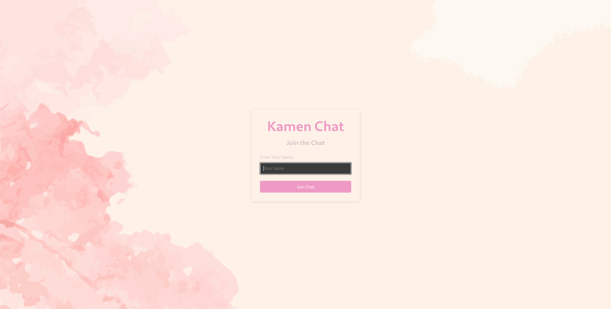
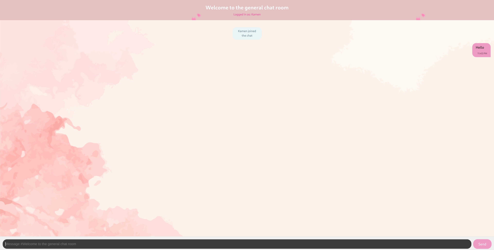

# 🚀 Real-Time Chat Application

A modern real-time chat application built with React (frontend) and Python/Django (backend), using WebSockets for instant messaging.


## ✨ Features

- **Real-time messaging** using WebSockets
- **Unique username** validation
- **Responsive design** works on all devices
- **Message history** with timestamps
- **System notifications** for user join/leave
- **Dockerized** for easy deployment
- **Typing indicators** (optional future feature)

## 🛠️ Tech Stack

**Frontend:**
- React.js
- WebSocket API
- UUID for unique user IDs
- CSS Modules for styling

**Backend:**
- Python
- Django + Django Channels
- WebSocket protocol

## 🚀 Getting Started

### Prerequisites
- Docker
- Docker Compose
- Node.js (for local frontend development)
- Python 3.8+ (for local backend development)

### Installation

#### Docker
```bash
# Clone the repository
git clone git@github.com:KamenHero/WebRTC.git

# Start the containers
make up

# Stopping the containers
make down

# Clearing the resources
make clear
```

### 🌐 Access the Application

#### Step 1:

- Visit: http://localhost:5173



#### Step 2:

- Choose a username and join the chat



#### Step 3:

- Enjoy real-time messaging!